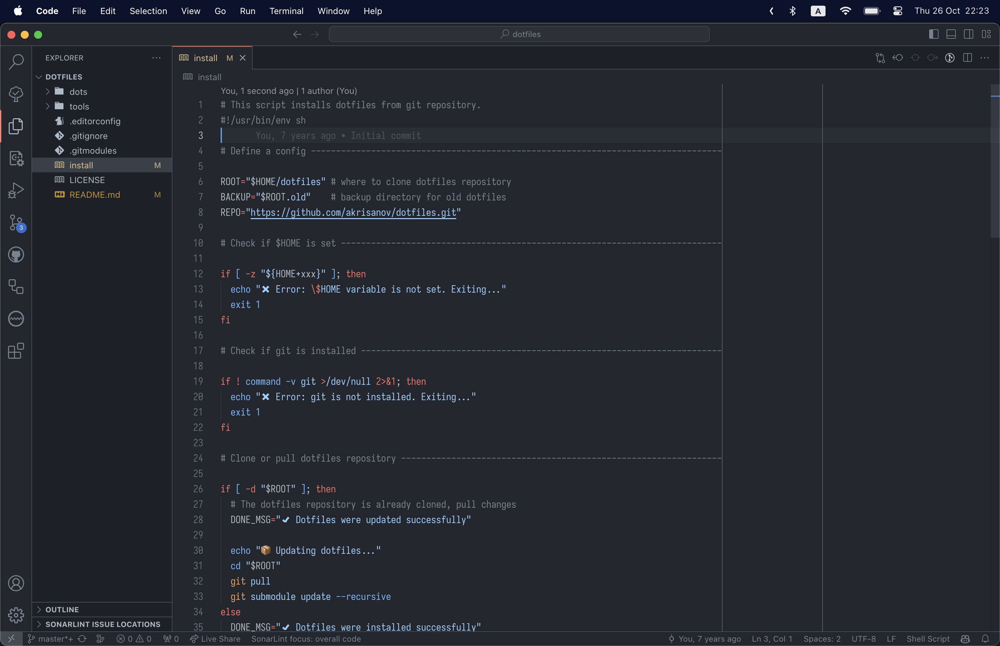
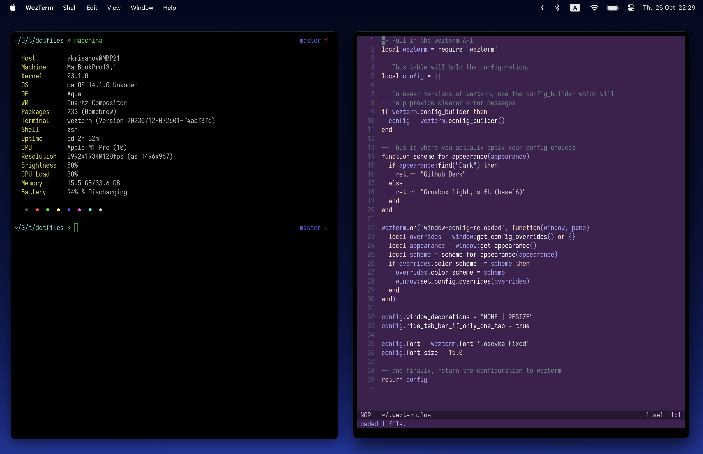

# Personal Dotfiles and Configs

## Prerequisites

- macOS (other Unix-like systems should work too with some tweaks)
- [Homebrew](https://brew.sh/)
- [Git](https://git-scm.com/)

## How To Install

Run the following command to download the configs to `$HOME/dotfiles` and create symlinks
from the contents of the `dots/` subdirectory in `$HOME`:

```bash
sh -c "$(curl -fsS https://raw.githubusercontent.com/akrisanov/dotfiles/master/install)"
```

If the dotfiles directory already exists, it will be backed up to `~/dotfiles.old/`.

## How To Update

The `install` script can be used to pull the latest version of the dotfiles from Github and update the symlinks:

```bash
~/dotfiles/install
```

## Installing Programs

Installing software and packages is done through Homebrew and Homebrew Cask.
The process is not automated, but these scripts can be used as a starting point.

Configure macOS settings:

```bash
~/dotfiles/tools/osx-tweaks
```

Install Homebrew packages:

```bash
~/dotfiles/tools/osx-brew
~/dotfiles/tools/osx-cask
```

## Terminal Emulator

I've recently switched from [iTerm2](https://iterm2.com/) to [wezterm](https://wezfurlong.org/wezterm/)
as my terminal of choice. You can find the configuration file in `dots/wezterm.lua`.
The config comes with automatic dark/light theme switching based on macOS appearance.

## Shell

[Zsh](https://www.zsh.org/) is old friend. Some configuration and plugins are managed by
[prezto](https://github.com/sorin-ionescu/prezto).

## Editors

I use [Visual Studio Code](https://code.visualstudio.com/) as my main editor and [Helix](https://helix-editor.com/)
when I edit files in the terminal.





## Favorite Fonts

Some of my favorite fonts are available through Homebrew Cask and are installed by the `osx-cask` script.

- [Iosevka](https://github.com/be5invis/Iosevka)
- [JetBrains Mono](https://github.com/JetBrains/JetBrainsMono)
- [FiraCode](https://github.com/tonsky/FiraCodes)

---

Copyright (c) 2021–2023 Andrey Krisanov
