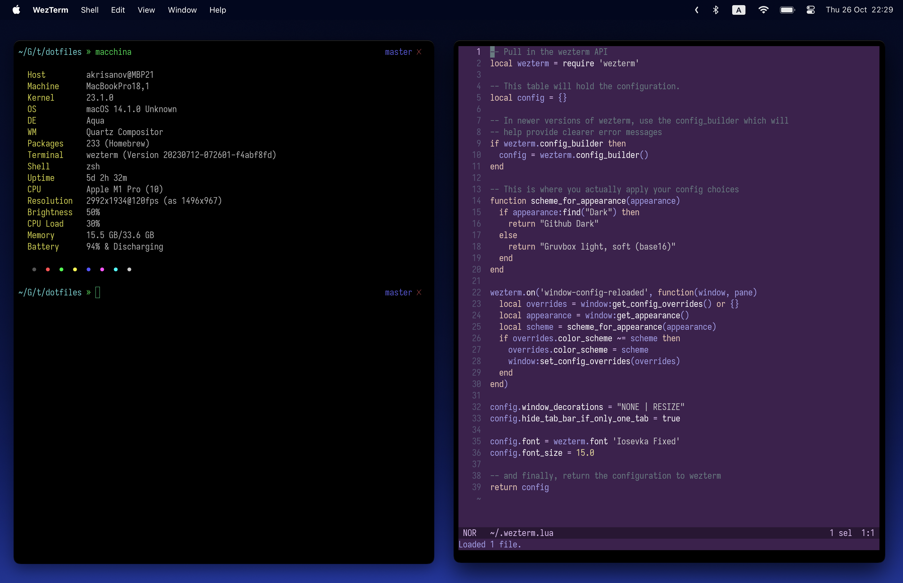

# Personal Dotfiles and Configs

## Prerequisites

- macOS or Linux
- [Git](https://git-scm.com/)

## How To Install

Run the bootstrap script to install [chezmoi](https://chezmoi.io) and apply all dotfiles in one step:

```bash
sh -c "$(curl -fsLS https://raw.githubusercontent.com/akrisanov/dotfiles/master/bootstrap.sh)"
```

chezmoi will prompt for personal data (name, email, GPG key) on first run and store the config at
`~/.config/chezmoi/chezmoi.toml`. Subsequent runs use saved values.

## How To Update

Pull changes and re-apply:

```bash
chezmoi update
```

Or apply local edits after making changes directly in the source directory:

```bash
chezmoi apply
```

## Installing Programs

Configure macOS settings:

```bash
~/dotfiles/tools/osx-tweaks
```

Install Homebrew packages:

```bash
~/dotfiles/tools/osx-brew
~/dotfiles/tools/osx-cask
```

## Terminal Emulator

I've recently switched from [iTerm2](https://iterm2.com/) to [wezterm](https://wezfurlong.org/wezterm/)
as my terminal of choice. You can find the configuration file in `dot_wezterm.lua`.
The config comes with automatic dark/light theme switching based on macOS appearance.

## Shell

[Zsh](https://www.zsh.org/) is old friend. Some configuration and plugins are managed by
[prezto](https://github.com/sorin-ionescu/prezto). It is installed automatically via
`run_once_install_zprezto.sh` when applying dotfiles with chezmoi.

## Editors

I use [Visual Studio Code](https://code.visualstudio.com/) as my main editor and [Helix](https://helix-editor.com/)
when I edit files in the terminal.



## Favorite Fonts

Some of my favorite fonts are available through Homebrew Cask and are installed by the `osx-cask` script.

- [Iosevka](https://github.com/be5invis/Iosevka)
- [JetBrains Mono](https://github.com/JetBrains/JetBrainsMono)
- [FiraCode](https://github.com/tonsky/FiraCodes)

---

Copyright (c) 2021–2026 Andrey Krisanov
